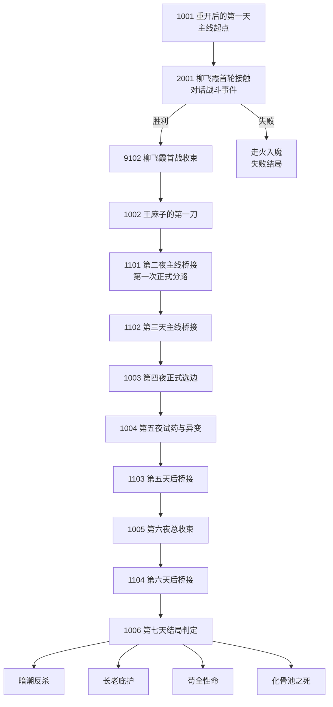
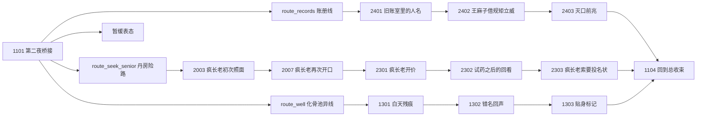
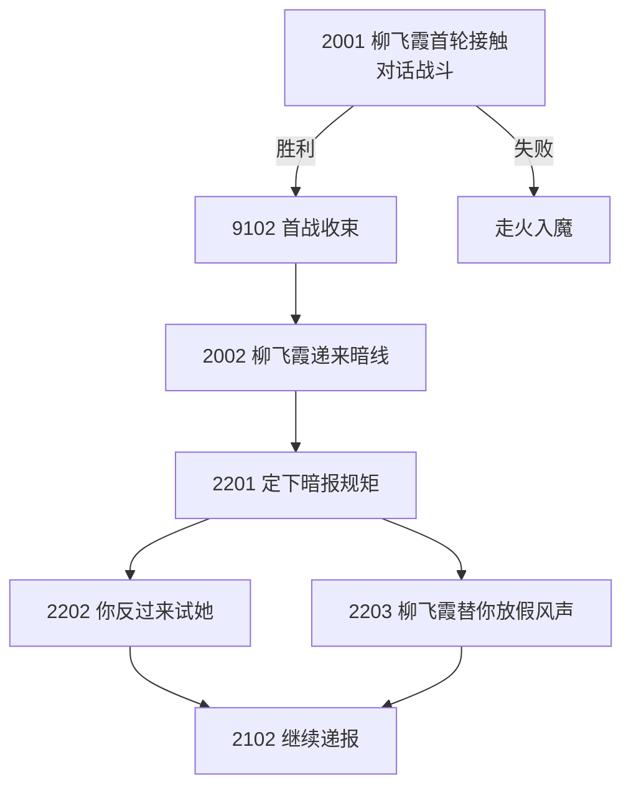
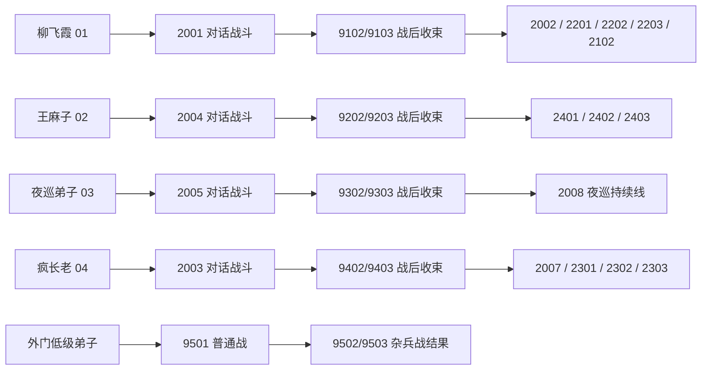

# Act 1 故事流程图

本文档用于把当前版本的 Act 1 故事结构压成可维护的流程图。

用途：
- 从全局看清玩家会经历哪些关键节点
- 看清主线桥接、人物线、事件类型之间的关系
- 后续补剧情时，先补“流程图上的缺口”，而不是零散补文案

约定：
- 节点编号继续使用现行数字编号
- 本文档描述“当前运行结构”，不是理想未来版本
- `主线节点 / 紧凑桥接 / 对话战斗 / 奖励 / 回顾 / 商店 / 随机 / 结局` 都按玩家体验分类

## 一、总流程图

## 二、中段分线图

## 三、柳飞霞线流程图

## 四、人物线与战斗线关系图

## 五、按事件类型分类的结构图

```mermaid
flowchart TD
    A[Act 1 当前事件结构]

    A --> B[对话战斗事件]
    A --> C[紧凑桥接事件]
    A --> D[摘要结果事件]
    A --> E[奖励事件]
    A --> F[回顾事件]
    A --> G[商店事件]
    A --> H[随机事件]
    A --> I[主线收束与结局事件]

    B --> B1[2001 柳飞霞首战]
    B --> B2[2004 王麻子]
    B --> B3[2005 夜巡弟子]
    B --> B4[2003 疯长老]
    B --> B5[9501 杂兵战]

    C --> C1[1101-1104 主线桥接]
    C --> C2[1301-1303 化骨池推进]
    C --> C3[2301-2303 疯长老推进]
    C --> C4[2401-2403 王麻子推进]

    D --> D1[9102/9103]
    D --> D2[9202/9203]
    D --> D3[9302/9303]
    D --> D4[9402/9403]
    D --> D5[9502/9503]

    E --> E1[2002]
    E --> E2[2102]
    E --> E3[2201-2203]
    E --> E4[2007]
    E --> E5[2302/2303]
    E --> E6[2402/2403]

    F --> F1[3301 破屋回息]
    F --> F2[3302 残页复盘]

    G --> G1[3401 后墙私换]
    G --> G2[3402 灰市换命]

    H --> H1[act1_res_* 资源随机]
    H --> H2[act1_rel_* 关系随机]
    H --> H3[act1_ano_* 异常随机]
    H --> H4[act1_risk_* 风险随机]

    I --> I1[1001-1006]
    I --> I2[ending_battle_deviation]
    I --> I3[其他结局分支]
```

## 六、玩家视角的最短理解路径

如果把它压成玩家最容易理解的一句话流程，就是：

1. 你重开第一天，先被柳飞霞试探。
2. 柳飞霞这场首战决定你能不能稳住第一条活路。
3. 第二天王麻子开始施压，说明外门筛人已经启动。
4. 第二夜和第三天的桥接节点，决定你主要往哪条线深挖。
5. 中段靠柳飞霞、王麻子、疯长老、化骨池几条线逐步拼出“谁在筛人、谁在补洞、谁在拿人试药”。
6. 第五夜到第六夜开始总收束，前面埋下的路线、关系和线索开始回到主线。
7. 第七天进入月考前后的最终判定，走向不同结局。

## 七、从流程图看当前最明显的内容缺口

当前故事已经可以被流程图概括，但还有 4 类缺口是肉眼可见的：

### 1. 夜巡线仍然最薄
- 目前是 `2005 -> 9302/9303 -> 2008`
- 还缺真正的第二拍和第三拍
- 所以它更像“执法阻碍”，还不像完整支线

### 2. 柳飞霞线最完整，但也最容易压过其他线
- 她既有首战，又有后续递报和分叉
- 新玩家很容易误以为她就是唯一主线
- 所以主线桥接必须继续承担“把视线推向其他线”的职责

### 3. 疯长老和化骨池线已经有递进，但还需要更稳定的承接
- 现在已经有 `2301-2303`、`1301-1303`
- 但前期必须继续避免“玩家还没正式认识，就默认玩家已经知道这条线”

### 4. 夜巡、随机、商店、回顾这些系统事件，已经有了结构，但还没形成完整内容池
- 回顾事件只有 `3301/3302`
- 商店事件只有 `3401/3402`
- 杂兵战只有 `9501`
- 随机事件虽然有一批，但仍然偏少

## 八、后续维护规则

后面每次补剧情节点时，建议先更新这份图，再写正文。

维护顺序：
1. 先看新节点属于哪条线
2. 再决定它是完整事件、紧凑桥接还是摘要结果
3. 最后再落到 Markdown 或 CSV

如果一个新节点放进图里之后，仍然说不清：
- 它接在谁后面
- 它把玩家推向哪里
- 它为什么值得存在

那这个节点大概率还不该写。
